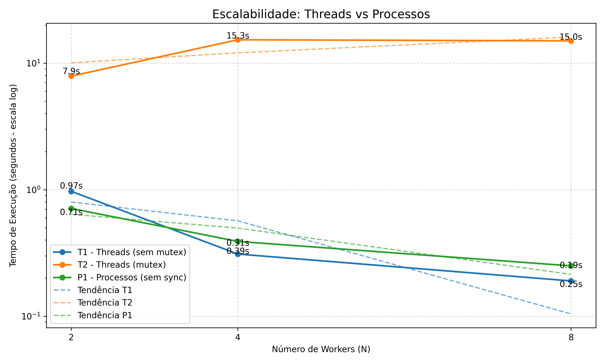

# Sistemas-operacionais-T1

#### Alunos: Willian Weyh, Davi Nunes, Guilherme S. Silva, Eduardo Castro
Repositório dedicado à implementação do Trabalho 1 da disciplina de Sistemas Operacionais, ministrada pelo professor 
Fillipo Novo Mor, na Pontifícia Universidade Católica do Rio Grande do Sul (PUCRS), no semestre 2026/02.

## Sumário

- [Objetivo do trabalho](#objetivo-do-trabalho)
- [Como rodar o programa](#como-rodar-o-programa)
    - [Passo 1 - Compilar o projeto](#passo-1---compilar-o-projeto)
    - [Passo 2 - Executar threads sem sincronização (T1)](#passo-2---executar-threads-sem-sincronização-t1)
    - [Passo 3 - Threads com mutex (T2)](#passo-3---threads-com-mutex-t2)
    - [Passo 4 - Processos sem sincronização (P1)](#passo-4---processos-sem-sincronização-p1)
    - [Passo 5 - Processos com semáforo (P2)](#passo-5---processos-com-semáforo-p2)
    - [Para medir tempo de execução](#para-medir-tempo-de-execução)
    - [Removendo classes de execução](#clean-remover-executaveis)
- [Ambiente e Hardware](#ambiente-e-hardware)
- [Tabela de tempo de execução](#tabela-de-tempo-de-execução)
- [Análise de Corrupção](#análise-de-corrupção)
- [Análise do gráfico](#análise-do-gráfico)
- [Observações técnicas](#observações-técnicas)
- [Conclusão](#conclusão)

## Objetivo do trabalho
O objetivo deste trabalho é comparar o comportamento de Threads (POSIX pthreads) e Processos (fork) em relação a 
três aspectos principais: overhead de criação, custo de comunicação e consistência de dados. Para isso, foi implementado 
um contador compartilhado que deve atingir o valor de 1 bilhão, distribuindo o trabalho entre múltiplas unidades de 
execução (N = 2, 4 e 8), com e sem mecanismos de sincronização.

## Como rodar o programa

### Passo 1 - Compilar o projeto

```bash
make all
```

### Passo 2 - Executar threads sem sincronização (T1)

```bash
make runT1 N=2
make runT1 N=4
make runT1 N=8
```

### Passo 3 - Threads com mutex (T2)

```bash
make runT2 N=2
make runT2 N=4
make runT2 N=8
```

### Passo 4 - Processos sem sincronização (P1)

```bash
make runP1 N=2
make runP1 N=4
make runP1 N=8
```

### Passo 5 - Processos com semáforo (P2)

```bash
make runP2 N=2
make runP2 N=4
make runP2 N=8
```

### Para medir tempo de execução
```bash
time make runT1 N=2
time make runT1 N=4
time make runT1 N=8

time make runT2 N=2
time make runT2 N=4
time make runT2 N=8

time make runP1 N=2
time make runP1 N=4
time make runP1 N=8

time make runP2 N=2
time make runP2 N=4
time make runP2 N=8
```
### Clean (Remover executaveis)
```bash
make clean
```

## Ambiente e Hardware
```
sysctl -a | grep hw.ncpu
hw.ncpu: 12
```

## Tabela de tempo de execução

Para a construção do gráfico de escalabilidade, cada experimento foi executado três vezes para cada valor de N (2, 4 e 8), 
e os tempos apresentados correspondem à média dessas execuções. Essa abordagem foi adotada para reduzir variações 
ocasionais causadas pelo sistema operacional, como escalonamento de processos e interferência de outras tarefas, 
garantindo maior confiabilidade e consistência nos resultados apresentados.

| N | T1 (sem mutex) | T2 (mutex) | P1 (sem sync) | P2 (com sync) |
|--|----------------|-----------|--------------|---------------|
| 2 | ~0.97s | ~7.9s | ~0.71s |
| 4 | ~0.31s | ~15.3s | ~0.39s |
| 8 | ~0.19s | ~15.0s | ~0.25s |

## Análise de Corrupção

Nos experimentos T1 e P1, o valor final do contador não atingiu 1 bilhão devido à ocorrência de condições de corrida 
(race conditions). A operação de incremento (counter++) não é atômica, sendo composta por leitura, incremento e escrita.
Quando múltiplas threads ou processos executam essa operação simultaneamente, ocorrem sobrescritas de valores, resultando 
na perda de incrementos.
Observou-se que, quanto maior o número de workers (N), menor o valor final obtido, evidenciando o aumento da concorrência 
e, consequentemente, das colisões de escrita. Em sistemas com múltiplos núcleos, esse efeito é amplificado devido ao 
paralelismo real proporcionado pelo hardware.

## Análise do gráfico


O gráfico apresenta a relação entre o tempo de execução e o número de workers (N) para os diferentes modelos de
execução avaliados. Observa-se que os cenários sem sincronização (T1 e P1) apresentam clara redução no tempo de execução
à medida que o número de threads/processos aumenta, evidenciando boa escalabilidade devido ao paralelismo efetivo — porém,
conforme discutido anteriormente, com resultados incorretos devido a condições de corrida. Em contraste, o cenário com
sincronização via mutex (T2) mantém o valor correto do contador, mas apresenta aumento significativo no tempo de execução,
especialmente ao passar de 2 para 4 workers, demonstrando o impacto do overhead de sincronização e da contenção do lock,
que limita o paralelismo. Nota-se ainda que, mesmo com o aumento de threads, o tempo em T2 não melhora, pois a região
crítica serializa o acesso ao contador. A utilização de escala logarítmica no eixo Y permite visualizar adequadamente as
diferenças entre os cenários, uma vez que os tempos variam em ordens de magnitude distintas. As linhas tracejadas representam
tendências aproximadas, reforçando o comportamento observado: ganho de desempenho sem sincronização e perda de escalabilidade
quando mecanismos de controle de concorrência são introduzidos.

## Observações técnicas

Os valores 0644 e 0666 representam permissões de acesso no padrão Unix, expressas em notação octal, sendo utilizados 
para definir quem pode ler ou escrever em recursos do sistema, como semáforos e memória compartilhada. Cada dígito 
corresponde, respectivamente, ao dono, grupo e outros usuários. 


O valor 0644 concede permissão de leitura e escrita ao dono (6 = 4 + 2), enquanto grupo e outros possuem apenas leitura (4). 
Já o valor 0666 permite leitura e escrita para todos os usuários. Além disso, a flag IPC_CREAT indica que o recurso deve 
ser criado caso ainda não exista. No contexto deste trabalho, essas permissões foram utilizadas para simplificar o acesso 
e evitar problemas de autorização durante a execução.


Durante a implementação do experimento com processos e semáforos (P2), foi observado um comportamento inicial de aparente 
travamento do programa, interpretado como um possível loop infinito. No entanto, identificou-se que a causa estava relacionada 
ao uso de semáforos nomeados (sem_open), que persistem no sistema mesmo após o término do processo. Quando uma execução 
anterior era interrompida abruptamente, o semáforo podia permanecer em estado inconsistente, fazendo com que chamadas 
subsequentes a sem_wait bloqueassem indefinidamente. Esse problema foi solucionado com a utilização de sem_unlink antes 
da criação do semáforo, garantindo um estado limpo a cada execução.


Adicionalmente, verificou-se que o uso de semáforos introduz um overhead significativo, tornando a execução substancialmente 
mais lenta, especialmente para grandes volumes de operações. Isso ocorre devido ao custo elevado das chamadas de sistema 
envolvidas em cada operação de sincronização.


Por fim, observou-se que a variação do hardware influencia diretamente a magnitude dos erros nos cenários sem sincronização. 
Em sistemas com múltiplos núcleos, o maior nível de paralelismo aumenta a probabilidade de acessos simultâneos à variável 
compartilhada, intensificando a ocorrência de condições de corrida e, consequentemente, a perda de incrementos.

## Conclusão
Os resultados obtidos demonstram claramente o trade-off entre desempenho e consistência em sistemas concorrentes.
Threads apresentaram menor overhead de criação em comparação com processos, pois são mais leves e compartilham o mesmo 
espaço de memória, evitando a necessidade de mecanismos adicionais de comunicação. Já os processos possuem maior custo 
de criação (via fork) e exigem o uso de memória compartilhada (shm) para comunicação, aumentando a complexidade e o overhead.
Em relação à comunicação, as threads mostraram-se mais eficientes, uma vez que compartilham memória de forma nativa, 
enquanto processos dependem de mecanismos de IPC, como memória compartilhada e semáforos, que introduzem maior custo operacional.
Os experimentos também evidenciaram que, embora a ausência de sincronização proporcione melhor desempenho (T1 e P1), ela 
resulta em inconsistência de dados. Por outro lado, o uso de mecanismos de sincronização (mutex e semáforos) garante a 
corretude do resultado, porém com impacto significativo no tempo de execução, especialmente no caso de processos com semáforos, 
devido ao alto custo das chamadas de sistema.
Assim, conclui-se que threads são mais eficientes para comunicação e possuem menor overhead, enquanto processos oferecem 
maior isolamento ao custo de desempenho e complexidade.