# Sistemas-operacionais-T1

#### Alunos: Willian Weyh, Davi Nunes, Guilherme S. Silva, Eduardo Castro
Repositório dedicado à implementação do Trabalho 1 da disciplina de Sistemas Operacionais, ministrada pelo professor 
Fillipo Novo Mor, na Pontifícia Universidade Católica do Rio Grande do Sul (PUCRS), no semestre 2026/02.

## Sumário

- [Objetivo do trabalho](#objetivo-do-trabalho)
- [Como rodar o programa](#como-rodar-o-programa)
    - [Passo 1 - Compilar o projeto](#passo-1---compilar-o-projeto)
    - [Passo 2 - Executar threads sem sincronização (T1)](#passo-2---executar-threads-sem-sincronização-t1)
    - [Passo 3 - Threads com mutex (T2)](#passo-3---threads-com-mutex-t2)
    - [Passo 4 - Processos sem sincronização (P1)](#passo-4---processos-sem-sincronização-p1)
    - [Passo 5 - Processos com semáforo (P2)](#passo-5---processos-com-semáforo-p2)
    - [Para medir tempo de execução](#para-medir-tempo-de-execução)
    - [Removendo classes de execução](#clean-remover-executaveis)
- [Ambiente e Hardware](#ambiente-e-hardware)
- [Tabela de tempo de execução](#tabela-de-tempo-de-execução)
- [Análise de Corrupção](#análise-de-corrupção)
- [Análise do gráfico](#análise-do-gráfico)
- [Observações técnicas](#observações-técnicas)
- [Conclusão](#conclusão)
- [Evidências](#evidências)
- [Links externos](#links)

## Objetivo do trabalho
O objetivo deste trabalho é comparar o comportamento de Threads (POSIX pthreads) e Processos (fork) em relação a 
três aspectos principais: overhead de criação, custo de comunicação e consistência de dados. Para isso, foi implementado 
um contador compartilhado que deve atingir o valor de 1 bilhão, distribuindo o trabalho entre múltiplas unidades de 
execução (N = 2, 4 e 8), com e sem mecanismos de sincronização.

## Como rodar o programa

### Passo 1 - Compilar o projeto

```bash
make all
```

### Passo 2 - Executar threads sem sincronização (T1)

```bash
make runT1 N=2
make runT1 N=4
make runT1 N=8
```

### Passo 3 - Threads com mutex (T2)

```bash
make runT2 N=2
make runT2 N=4
make runT2 N=8
```

### Passo 4 - Processos sem sincronização (P1)

```bash
make runP1 N=2
make runP1 N=4
make runP1 N=8
```

### Passo 5 - Processos com semáforo (P2)

```bash
make runP2 N=2
make runP2 N=4
make runP2 N=8
```

### Para medir tempo de execução
```bash
time make runT1 N=2
time make runT1 N=4
time make runT1 N=8

time make runT2 N=2
time make runT2 N=4
time make runT2 N=8

time make runP1 N=2
time make runP1 N=4
time make runP1 N=8

time make runP2 N=2
time make runP2 N=4
time make runP2 N=8
```
### Clean (Remover executaveis)
```bash
make clean
```

## Ambiente e Hardware
Hardware utilizado em x86
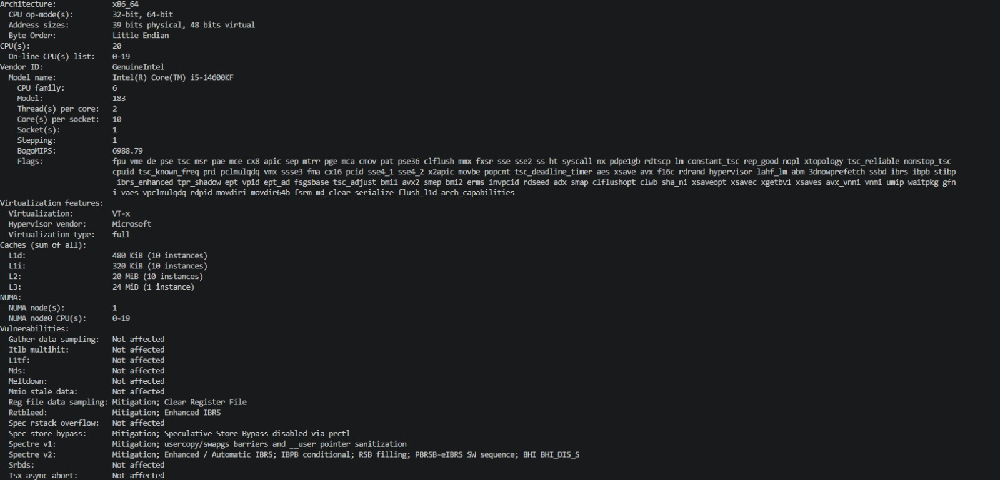

Hardware ARM
```
sysctl -a | grep hw.ncpu
hw.ncpu: 12
```
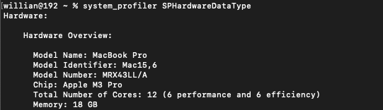

Para este trabalho foram criadas 4 classe sendo elas

``` c
threads_no_mutex.c -> Nosso T1, programa com threads sem mutex
threads_mutex.c -> Nosso T2, programa com threads aplicando o mutex

process_free.c -> Nosso P1, programa com processos sem utilizar semáforos
process_sem.c -> Nosso P2, programa com processos e utilizando dos semáforos

```

## Tabela de tempo de execução

Para a construção do gráfico de escalabilidade, os experimentos foram executados em dois ambientes distintos, 
correspondentes às arquiteturas x86, ARM e no codespace. Em cada ambiente, cada experimento foi executado três vezes para cada valor 
de N (2, 4 e 8), sendo apresentados os tempos médios dessas execuções. Essa abordagem foi adotada para reduzir variações 
ocasionais causadas pelo sistema operacional, como escalonamento de processos e interferência de outras tarefas, 
garantindo maior confiabilidade, consistência dos resultados e permitindo uma comparação mais precisa entre as diferentes 
arquiteturas.

### Arquitetura Arm
| N | T1 - Threads (sem mutex) | T2 - Threads (mutex) | P1 - Processos (sem sync) | P2 - Processos (semáforo) |
|--|---------------------------|----------------------|----------------------------|----------------------------|
| 2 | 0.736s | 8.077s  | 0.732s | 51m07.70s |
| 4 | 0.315s | 16.632s | 0.340s | 38m43.00s |
| 8 | 0.187s | 15.163s | 0.212s | 54m52.94s |

## Arquitetura (x86)

| N | T1 - Threads (sem mutex) | T2 - Threads (mutex) | P1 - Processos (sem sync) | P2 - Processos (semáforo) |
|--|---------------------------|----------------------|----------------------------|----------------------------|
| 2 | 1.083s | 38.671s | 0.917s | 1m21.560s |
| 4 | 1.004s | 35.285s | 0.850s | 1m30.724s |
| 8 | 1.089s | 38.774s | 1.071s | 2m15.551s |

## Codespace
| N | T1 - Threads (sem mutex) | T2 - Threads (mutex) | P1 - Processos (sem sync) | P2 - Processos (semáforo) |
|--|---------------------------|----------------------|----------------------------|----------------------------|
| 2 | 2.682s | 25.724s | 2.879s | 25.787s |
| 4 | 2.776s | 25.643s | 2.919s | 43.734s |
| 8 | 2.876s | 27.689s | 2.546s | 2m1.016s |

## Análise de Corrupção

Nos experimentos T1 e P1, o valor final do contador não atingiu 1 bilhão devido à ocorrência de condições de corrida
(race conditions). A operação de incremento (counter++) não é atômica, sendo composta por leitura, incremento e escrita.
Quando múltiplas threads ou processos executam essa operação simultaneamente, ocorrem sobrescritas de valores, resultando
na perda de incrementos.

Observa-se um comportamento claro: **quanto maior o número de workers (N), maior o erro no valor final**. 
Pode ser observado nas [evidências do projeto](#evidências).

Isso ocorre porque o aumento de paralelismo intensifica a quantidade de acessos simultâneos à variável compartilhada, elevando drasticamente
a probabilidade de colisões.

Esse padrão é consistente em todos os ambientes testados (local e Codespace), evidenciando que o problema não está no
hardware em si, mas no modelo de concorrência sem sincronização. Em outras palavras, aumentar N melhora o desempenho,
mas degrada progressivamente a corretude do resultado.

## Análise do gráfico
#### Arquitetura Arm
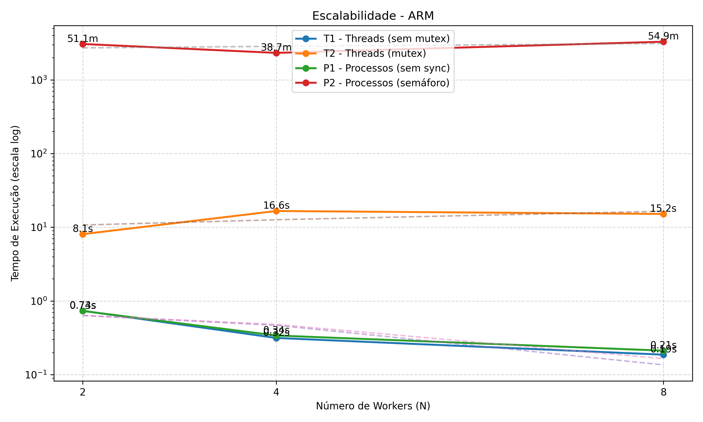

#### Arquitetura X86
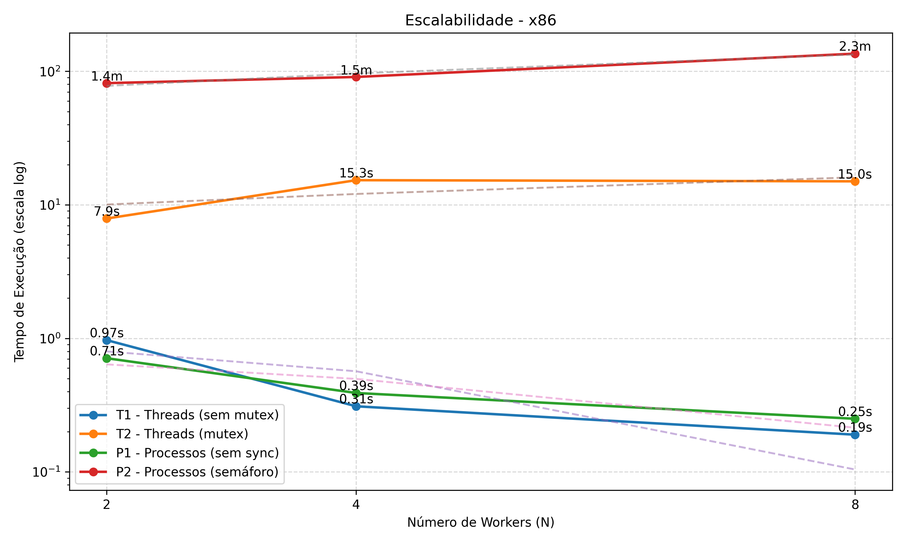

#### Codespace
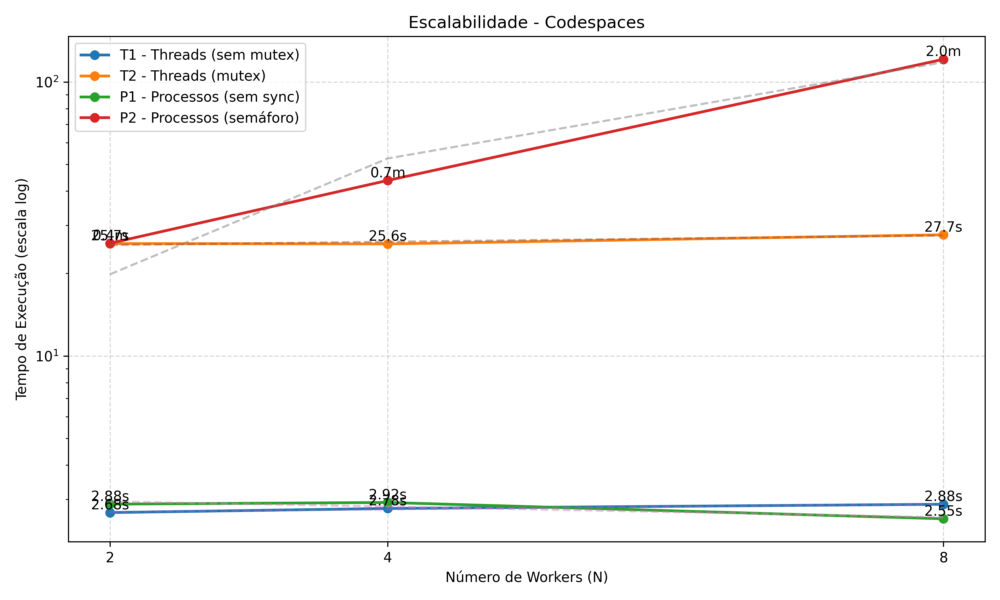

O conjunto de gráficos apresenta a relação entre o tempo de execução e o número de workers (N) para os diferentes modelos 
de execução, considerando dois contextos principais: execução local e execução em ambiente remoto (Codespace).
Nos cenários sem sincronização (T1 e P1), observa-se uma redução no tempo de execução à medida que N aumenta, 
evidenciando ganho de paralelismo. Entretanto, esse ganho ocorre à custa da corretude dos resultados, conforme 
discutido na análise de corrupção. Verifica-se um padrão consistente em que o aumento de N intensifica o erro acumulado 
no contador, devido à maior incidência de condições de corrida.
Por outro lado, nos cenários com sincronização (T2 e P2), o valor final do contador permanece correto independentemente 
do número de workers. Em contrapartida, há um aumento significativo no tempo de execução, decorrente do custo associado 
ao controle de acesso à região crítica, o que limita o paralelismo efetivo.
Ao considerar o ambiente de execução em Codespace, observa-se um comportamento distinto em relação à execução local. 
De forma geral, os tempos de execução são mais elevados e apresentam maior variabilidade, além de um ganho de desempenho 
menos expressivo com o aumento de N. Esse comportamento pode ser atribuído ao overhead inerente ao ambiente remoto, 
caracterizado pelo compartilhamento de recursos e pela virtualização.
Dessa forma, enquanto a execução local tende a oferecer maior previsibilidade e melhor aproveitamento do paralelismo, 
o Codespace introduz fatores adicionais que impactam negativamente a escalabilidade, especialmente em cenários com maior 
nível de concorrência.

## Observações técnicas

## Observações técnicas

Os valores `0644` e `0666` representam permissões de acesso no padrão Unix, expressas em notação octal, sendo utilizados para
definir quem pode ler ou escrever em recursos do sistema, como semáforos e memória compartilhada. Cada dígito corresponde,
respectivamente, ao dono, grupo e outros usuários. O valor `0644` concede permissão de leitura e escrita ao dono (6 = 4 + 2),
enquanto grupo e outros possuem apenas leitura (4). Já o valor `0666` permite leitura e escrita para todos os usuários.
Além disso, a flag `IPC_CREAT` indica que o recurso deve ser criado caso ainda não exista. No contexto deste trabalho,
essas permissões foram utilizadas para simplificar o acesso e evitar problemas de autorização durante a execução.

Durante a implementação do experimento com processos e semáforos (P2), foi observado um comportamento inicial de aparente
travamento do programa, interpretado como um possível loop infinito. No entanto, identificou-se que a causa estava
relacionada ao uso de semáforos nomeados (`sem_open`), que persistem no sistema mesmo após o término do processo.
Quando uma execução anterior era interrompida abruptamente, o semáforo podia permanecer em estado inconsistente,
fazendo com que chamadas subsequentes a `sem_wait` bloqueassem indefinidamente. Esse problema foi solucionado com a
utilização de `sem_unlink` antes da criação do semáforo, garantindo um estado limpo a cada execução.

Adicionalmente, verificou-se que o uso de semáforos introduz um overhead significativo, tornando a execução substancialmente
mais lenta, especialmente para grandes volumes de operações. Isso ocorre devido ao custo elevado das chamadas de sistema
envolvidas em cada operação de sincronização, já que cada incremento do contador exige operações de bloqueio e desbloqueio
controladas pelo sistema operacional.

Com a execução dos experimentos em diferentes arquiteturas (x86 e ARM), foi possível observar uma diferença significativa
de desempenho, especialmente no cenário P2 (processos com semáforo). Notou-se que, na arquitetura x86 (Intel Core i5-14600KF),
o tempo de execução foi consideravelmente menor em comparação com a arquitetura ARM. Essa diferença ocorre principalmente
devido a fatores arquiteturais e de implementação de sistema operacional. Processadores x86 tendem a possuir maior
desempenho em operações que envolvem chamadas de sistema intensivas, como `sem_wait` e `sem_post`, além de apresentarem maior
frequência de clock e otimizações mais maduras para execução concorrente. Por outro lado, arquiteturas ARM, embora mais
eficientes energeticamente, geralmente possuem maior latência em operações de sincronização e menor desempenho em workloads
altamente dependentes de syscalls. Além disso, o experimento P2 é fortemente limitado pelo custo de sincronização, já que
cada incremento exige duas chamadas de sistema. Nesse contexto, qualquer diferença na eficiência dessas operações entre
arquiteturas se torna amplificada, justificando a discrepância observada nos tempos de execução.

Por fim, observou-se que a variação do hardware também influencia diretamente a magnitude dos erros nos cenários sem
sincronização. Em sistemas com múltiplos núcleos, o maior nível de paralelismo aumenta a probabilidade de acessos
simultâneos à variável compartilhada, intensificando a ocorrência de condições de corrida e, consequentemente, a perda de
incrementos.

## Conclusão
Os resultados obtidos demonstram de forma clara o trade-off entre desempenho e consistência em sistemas concorrentes.
As threads apresentaram menor overhead de criação em comparação com processos, por serem mais leves e compartilharem o
mesmo espaço de memória, eliminando a necessidade de mecanismos adicionais de comunicação. Em contrapartida, os processos
possuem maior custo de criação (via `fork`) e dependem de memória compartilhada (`shm`) para comunicação, o que aumenta a
complexidade e o overhead da solução.

No que se refere à comunicação, as threads mostraram-se mais eficientes, uma vez que compartilham memória de forma nativa,
enquanto processos dependem de mecanismos de IPC, como memória compartilhada e semáforos, que introduzem maior custo operacional.

Os experimentos evidenciaram ainda que, embora a ausência de sincronização proporcione melhor desempenho (T1 e P1), ela
resulta em inconsistência de dados devido à ocorrência de condições de corrida. Por outro lado, o uso de mecanismos de
sincronização (mutex e semáforos) garante a corretude dos resultados, porém com impacto significativo no tempo de execução.
Esse impacto é especialmente evidente no cenário de processos com semáforos (P2), em função do alto custo das chamadas de
sistema envolvidas em cada operação de sincronização.

Além disso, a execução em ambiente remoto (Codespace) evidenciou que o contexto de execução influencia diretamente o
desempenho e a escalabilidade. Ambientes compartilhados e virtualizados tendem a introduzir maior overhead e variabilidade,
reduzindo a previsibilidade dos resultados quando comparados à execução local.

Outro ponto relevante observado foi que, nos cenários sem sincronização, o aumento do número de workers (N) intensifica o
erro no resultado final. Esse comportamento reforça que desempenho e corretude são objetivos conflitantes em sistemas
concorrentes, exigindo o uso adequado de mecanismos de sincronização conforme os requisitos da aplicação.

Dessa forma, conclui-se que threads são mais eficientes em termos de comunicação e possuem menor overhead de criação,
enquanto processos oferecem maior isolamento, ao custo de desempenho e maior complexidade. Adicionalmente, a escolha do
modelo de concorrência deve considerar não apenas o tipo de carga de trabalho, mas também o ambiente de execução e o nível
de consistência exigido pela aplicação.

## Evidências

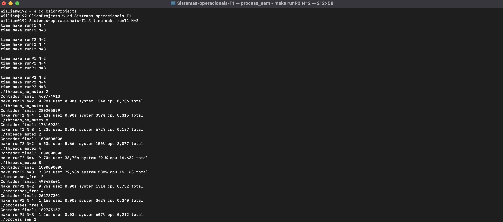

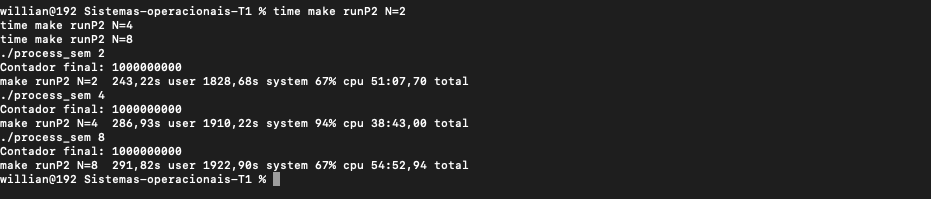

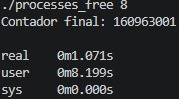
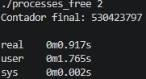
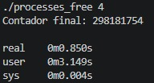


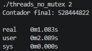
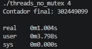
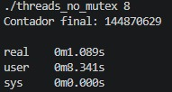

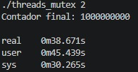
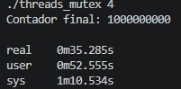
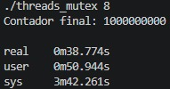

#### Output codespace
```
./threads_no_mutex 2
Contador final: 623217670

real    0m2.682s
user    0m4.031s
sys     0m0.009s
./threads_no_mutex 4
Contador final: 346791097

real    0m2.776s
user    0m4.436s
sys     0m0.008s
./threads_no_mutex 8
Contador final: 220474219

real    0m2.876s
user    0m4.519s
sys     0m0.008s
./threads_mutex 2
Contador final: 1000000000

real    0m25.724s
user    0m18.520s
sys     0m21.807s
./threads_mutex 4
Contador final: 1000000000

real    0m25.643s
user    0m18.817s
sys     0m22.058s
./threads_mutex 8
Contador final: 1000000000

real    0m27.689s
user    0m20.067s
sys     0m24.469s
./processes_free 2
Contador final: 549925224

real    0m2.879s
user    0m4.467s
sys     0m0.010s
./processes_free 4
Contador final: 289638921

real    0m2.919s
user    0m4.742s
sys     0m0.021s
./processes_free 8
Contador final: 177732824

real    0m2.546s
user    0m3.681s
sys     0m0.029s
./process_sem 2
Contador final: 1000000000

real    0m25.787s
user    0m16.610s
sys     0m24.878s
./process_sem 4
Contador final: 1000000000

real    0m43.734s
user    0m20.651s
sys     0m49.143s
./process_sem 8
Contador final: 1000000000

real    2m1.016s
user    0m38.309s
sys     2m35.318s
```

## Links
- [Vídeo tutorial de pthreads] (https://www.youtube.com/watch?v=ldJ8WGZVXZk&t=305s)
- [Vídeo tutorial de pthreads com Mutex] (https://www.youtube.com/watch?v=raLCgPK-Igc)
- [Argumentos em linha de comando] (https://www.geeksforgeeks.org/cpp/command-line-arguments-in-c-cpp/)
- [Processo e Semáfaros] (https://www.youtube.com/watch?v=ukM_zzrIeXs)
- [Octal Notation] (https://medium.com/@thapavishal117/linux-permissions-using-numbers-known-as-octal-notation-2081f554c645)
- [Memória Compartilhada] (https://www.youtube.com/watch?v=WgVSq-sgHOc)